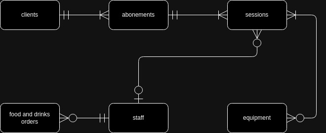
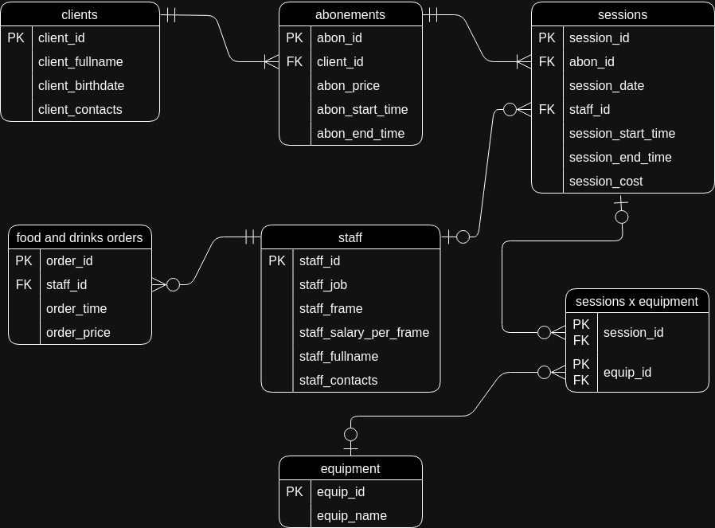
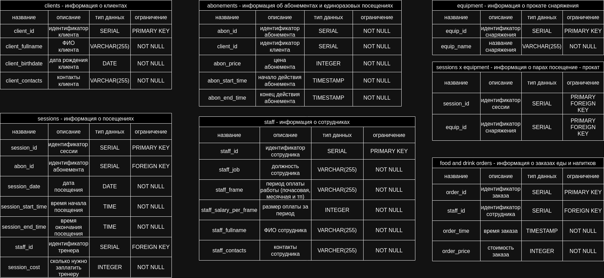

# Проект по базам данных
Темой проекта был выбран скалодром, я смоделировал его деятельность с помощью базы данных и языка программирования PostgreSQL. Технически, модель может быть применена и для спортзала, но скалодром, пожалуй, поинтереснее.

## Защита темы. Выбор сущностей
Сущностями были выбраны: Клиенты, Абонементы (единоразовое посещение включено в абонементы), Посещения, Сотрудники, Заказы (еда и напитки), Прокатное снаряжение.

## Концептуальная модель
Концептуальная модель была создана в виде таблицы, на которой изображены сущности и взаимоотношения между ними.

## Логическая модель
Логическая модель была создана путем добавления атрибутов в талицы и выделения первичных и внешних ключей. Для нормализации выбрана третья нормальная форма.

## Физическая модель

Физическая модель представляет множество таблиц, каждая их которых описывает базу данных, так же в ней показаны типы данных и все ограничения.

## Реализация таблицы и её заполнение
С помощью PostgreSQL создадим все [таблицы](init.sql) и зададим отношение между ними.
[Заполняем](insert.sql) таблицы базы данных.

## 10 осмысленных запросов
Ожидаемый вывод всех скриптов написан прямо в [файле](requests.sql), запросы содержат WHERE, GROUP BY, HAVING, ORDER BY, JOIN, подзапросы. 

# Дополнитеольная часть

## функции и процедуры
Создал следующие [функции](functions_and_procedures.sql):

    добавление нового клиента

    добавление нового сотрудника
    
    подсчет общей стоимости заказов для указанной даты
